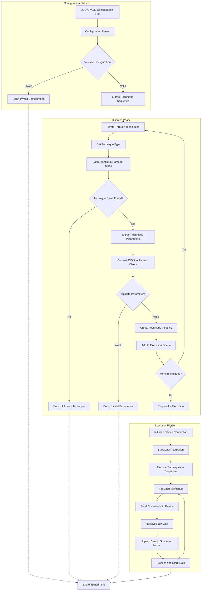

# Dispatch Process Flow Diagram

The above diagram illustrates the complete dispatch process in the electrochemical experiment automation system. The process is divided into three main phases:

## 1. Configuration Phase

- **JSON/YAML Configuration File**: The process begins with a configuration file that defines the experiment sequence and parameters.
- **Configuration Parser**: The system parses the configuration file to extract the experiment structure.
- **Validate Configuration**: The overall configuration structure is validated to ensure it contains all required sections.
- **Extract Technique Sequence**: The sequence of techniques to be executed is extracted from the configuration.

## 2. Dispatch Phase

- **Iterate Through Techniques**: The system iterates through each technique in the sequence.
- **Get Technique Type**: For each technique, its type (e.g., "ca", "cv", "peis") is identified.
- **Map Technique Name to Class**: The technique name is mapped to the corresponding technique class (e.g., "ca" → CATechnique).
- **Extract Technique Parameters**: Parameters for the technique are extracted from the configuration.
- **Convert JSON to Params Object**: JSON parameters are converted to a structured parameters object (e.g., CAParams).
- **Validate Parameters**: The parameters are validated to ensure they meet the requirements of the technique.
- **Create Technique Instance**: A technique instance is created with the validated parameters.
- **Add to Execution Queue**: The technique instance is added to the execution queue.
- **Prepare for Execution**: Once all techniques are processed, the system prepares for execution.

## 3. Execution Phase

- **Initialize Device Connection**: Connection to the electrochemical device is established.
- **Start Data Acquisition**: Data acquisition system is initialized.
- **Execute Techniques in Sequence**: Techniques are executed in the order they were defined.
- **Send Commands to Device**: For each technique, commands are sent to the device.
- **Receive Raw Data**: Raw data is received from the device.
- **Unpack Data to Structured Format**: Raw data is unpacked into structured data objects (e.g., CAData).
- **Process and Store Data**: Data is processed, visualized, and stored.

## Error Handling

The system includes error handling at multiple stages:
- Configuration validation errors
- Unknown technique errors
- Parameter validation errors
- Device communication errors (not shown in detail)

This dispatch process enables the system to convert high-level experiment descriptions into executable electrochemical techniques while handling the complexity of device communication and data processing.
